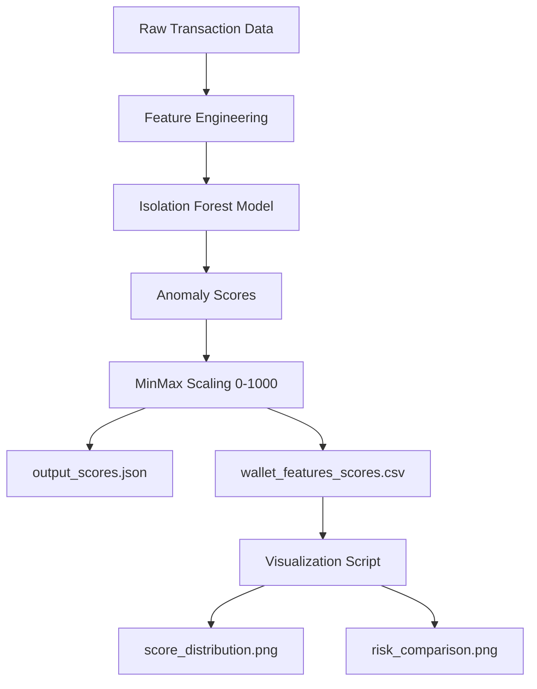

# Aave V2 Portal Analysis - Wallet Credit Scoring System

[](https://www.python.org/downloads/)
[](LICENSE)

A machine learning-based credit scoring system for cryptocurrency wallets that analyzes transaction behavior on the Aave V2 protocol. The system uses unsupervised anomaly detection to assign credit scores ranging from 0-1000, helping identify reliable users versus risky behavior patterns.

## 🎯 Features

- **Automated Credit Scoring**: Assigns scores (0-1000) based on wallet transaction patterns
- **Feature Engineering**: Extracts 17+ behavioral features from raw transaction data
- **Anomaly Detection**: Uses Isolation Forest algorithm to identify unusual patterns
- **Visual Analytics**: Generates distribution plots and risk comparison charts
- **Data Export**: Outputs results in both JSON and CSV formats for further analysis

## 📋 Prerequisites

- Python 3.7 or higher
- pip (Python package manager)
- Input transaction data in JSON format

## 🚀 Installation

1. **Clone the repository**
   ```bash
   git clone https://github.com/saai07/v2-portal-analysis.git
   cd v2-portal-analysis
   ```

2. **Install dependencies**
   ```bash
   pip install -r requirements.txt
   ```
   
   Required packages:
   - pandas
   - numpy
   - matplotlib
   - seaborn
   - scikit-learn

3. **Prepare input data**
   - Place your `input_transactions.json` file in the root directory
   - The file should contain transaction data from Aave V2 protocol

## 📖 Usage

### Step 1: Generate Credit Scores

Run the main scoring script to process transaction data and generate credit scores:

```bash
python zeru.py
```

**Outputs:**
- `output_scores.json` - Wallet addresses with their credit scores
- `wallet_features_scores.csv` - Detailed features and scores for each wallet

### Step 2: Generate Visualizations

Create analytical plots and charts:

```bash
python plot.py
```

**Outputs:**
- `score_distribution.png` - Distribution of credit scores across all wallets
- `risk_comparison.png` - Behavioral comparison between low and high-risk wallets

## 📁 Project Structure

```
v2-portal-analysis/
├── Data/
│   └── input_transactions.json    # Input transaction data (91MB+)
├── output/
│   ├── output_scores.json         # Generated credit scores
│   └── wallet_features_scores.csv # Features + scores dataset
├── zeru.py                        # Main scoring engine
├── plot.py                        # Visualization generator
├── requirements.txt               # Python dependencies
├── analysis.md                    # Detailed analysis report
└── README.md                      # This file
```

## 🧠 Methodology

### Algorithm: Isolation Forest

The system uses **Isolation Forest**, an unsupervised machine learning algorithm designed for anomaly detection.

**Why Isolation Forest?**
- ✅ Effective for identifying unusual patterns in unlabeled data
- ✅ Handles high-dimensional feature spaces efficiently
- ✅ Computationally efficient for large datasets
- ✅ No need for labeled training data

**How it works:**
1. Creates random decision trees to isolate data points
2. Anomalies require fewer splits to isolate (shorter path length)
3. Normal behavior requires more splits (longer path length)
4. Scores are normalized to 0-1000 range (higher = more trustworthy)

### Feature Engineering

The system extracts 17 behavioral features from transaction data:

| Feature | Description | Risk Significance |
|---------|-------------|-------------------|
| `repay_ratio` | Repayments / Borrows | Measures debt responsibility |
| `liquidation_ratio` | Liquidations / Borrows | Default risk indicator |
| `utilization` | Net Borrows / Net Deposits | Leverage risk assessment |
| `tx_frequency` | Transactions per day | Detects bot-like behavior |
| `wallet_age` | Days since first transaction | Long-term commitment indicator |
| `time_variance` | Variance in transaction timing | Pattern consistency |
| `n_deposit` | Number of deposit transactions | Activity level |
| `n_borrow` | Number of borrow transactions | Borrowing frequency |
| `n_repay` | Number of repayment transactions | Repayment behavior |
| `n_liquidation` | Number of liquidations | Risk event count |
| `net_deposit` | Total deposits - redeemed | Net capital provided |
| `net_borrow` | Total borrowed - repaid | Outstanding debt |
| `avg_tx_size` | Average transaction size (USD) | Transaction magnitude |

## 📊 Output Files

### 1. output_scores.json
JSON file containing wallet addresses and their credit scores:
```json
{
  "wallets": [
    {
      "user": "0x1234...",
      "credit_score": 785.32
    },
    ...
  ]
}
```

### 2. wallet_features_scores.csv
CSV file with all extracted features and computed scores for each wallet. Useful for:
- Detailed behavioral analysis
- Custom score recalculation
- Feature importance studies
- Risk segmentation

### 3. Visualization Outputs

**score_distribution.png**
- Shows distribution of wallets across score ranges
- Includes percentage breakdowns
- Helps identify concentration patterns

**risk_comparison.png**
- Compares behavioral features between low-risk (700-1000) and high-risk (0-400) wallets
- Highlights key differentiating factors
- Provides statistical insights

## 📊 Example Results

Key behavioral differences identified:

| Metric | Low Risk (700-1000) | High Risk (0-400) |
|--------|---------------------|-------------------|
| Repayment Ratio | 96% | 87% |
| Liquidation Ratio | 5% | 0% |
| Utilization | 88% | 276323362569% |
| TX Frequency | 5.1/day | 566.6/day |

*See [analysis.md](analysis.md) for detailed findings and visualizations.*

## 🔧 Configuration

You can modify model parameters in `zeru.py`:

```python
model = IsolationForest(
    n_estimators=1000,      # Number of trees
    max_samples=256,        # Samples per tree
    contamination=0.05,     # Expected anomaly ratio
    random_state=42         # Reproducibility seed
)
```

## 📈 System Architecture



## 🤝 Contributing

Contributions are welcome! Please feel free to submit a Pull Request. For major changes:

1. Fork the repository
2. Create your feature branch (`git checkout -b feature/AmazingFeature`)
3. Commit your changes (`git commit -m 'Add some AmazingFeature'`)
4. Push to the branch (`git push origin feature/AmazingFeature`)
5. Open a Pull Request

## 📝 License

This project is licensed under the MIT License - see the [LICENSE](LICENSE) file for details.

## 👤 Author

**saai07**
- GitHub: [@saai07](https://github.com/saai07)
- Project: [v2-portal-analysis](https://github.com/saai07/v2-portal-analysis)

## 🙏 Acknowledgments

- Aave Protocol for providing transaction data
- scikit-learn for the Isolation Forest implementation
- The DeFi community for inspiration and use cases

## 📧 Contact

For questions, issues, or suggestions, please open an issue on GitHub or contact the maintainer.

---

**Note**: This system is for analytical purposes only. Credit scores should be used as one of many factors in decision-making processes.

